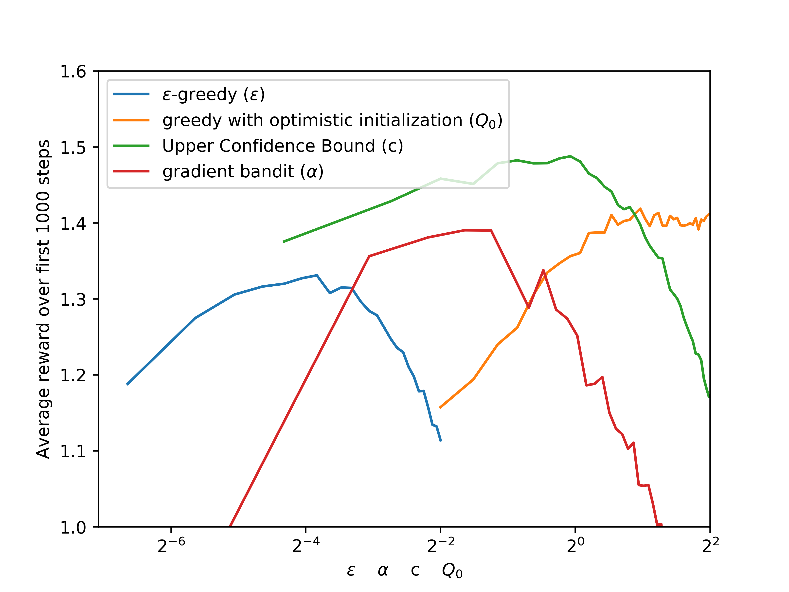
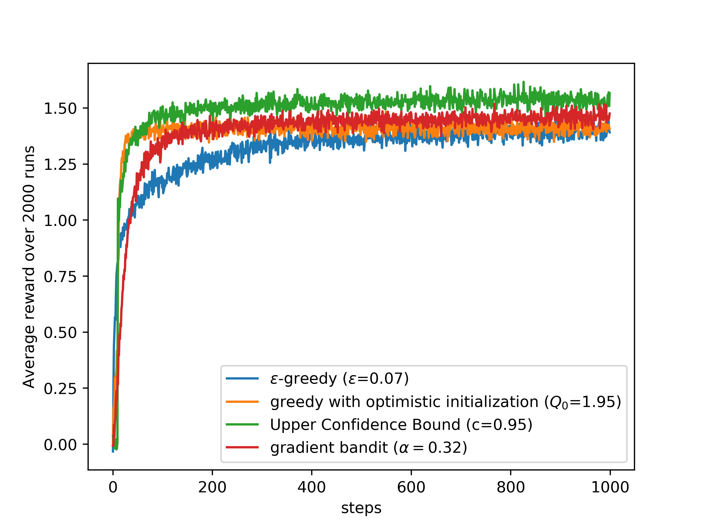

# k-armed Bandit Problem
Solve k-armed bandit problem with ε-greedy (sample-average) method, greedy (sample-average) method with optimistic initial action values, Upper-Confidence-Bound action selection and bandit gradient algorithm. Do parameter study for these four algorithms and compare them under their respective best parameter values.

## Environment
- `python 3.6.7`  
- `numpy 1.18.5`  
- `matplotlib 1.3.1`  
- `tqdm 4.60.0`  

## Result
### parameter study  
<left class="half">
    
</left>  
It's obvious that all algorithms perform well within a wide range of parameter values.

 

### performance comparison under respective best parameter values  
<left class="half">
    
</left>  
It's shown that Upper-Confidence-Bound > gradient bandit > greedy with optimistic initialization > ε-greedy.