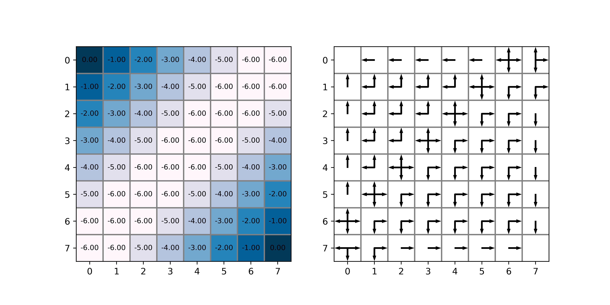

# Policy Iteration & Value Iteration
Solve simple Grid-World problem with Policy Iteration and Value Iteration respectively.

## Environment
- `python 3.6.7`  
- `numpy 1.18.5`  
- `matplotlib 1.3.1`  
- `pyqt5 5.15.4`  

## Grid-World

<left class="half">
    
</left>  

 

| Info |Description|
|----|----|
|Size|8x8|
|Start|random|
|End|(0,0) or (7,7)|
|State|position coordinates|
|Action|{Up, Down, Left, Right}|
|Reward| -1 for each step|
|Discount factor| γ=1|

## Policy Iteration

### Init
<left class="half">
    
</left>  

 
 

### Iteration 1

<left class="half">
    
</left>  

 
 

### Iteration 2

<left class="half">
    
</left>  

 
 
 

## Value Iteration

### Init
<left class="half">
    
</left>  

 
 

### Iteration 1

<left class="half">
    
</left>  

 
 

### Iteration 2

<left class="half">
    
</left>  

 
 

### Iteration 3

<left class="half">
    
</left>  

 
 

### Iteration 4

<left class="half">
    
</left>  

 
 

### Iteration 5

<left class="half">
    
</left>  

 
 

### Iteration 6

<left class="half">
    
</left>  

 
 

### Iteration 7

<left class="half">
    
</left>  